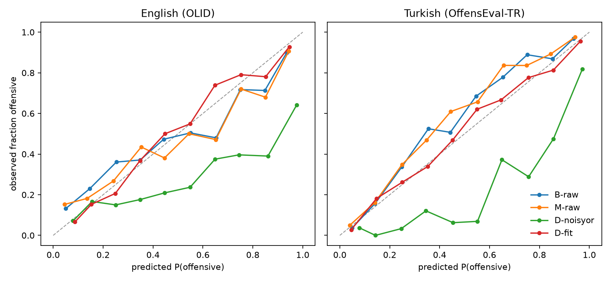

# Most of Jev's decomposition gain was the definition

An independent test of TypeSafe's Jev (`jev-1.13.0`) on one open question:
**does splitting a judgment into atomic questions help, and does that hold
outside English?** Tested on offensive-language detection in English and
Turkish, 1,000 posts each, 4,000 requests, **$0.07** total.



## Why this question

Two published results point in opposite directions:

- Asking "is this phishing?" once scored **62.6%**; splitting it into five
  narrow questions with fitted weights reached **95.0%**
  ([report](https://www.beri.net/article/typesafe-jev-typed-decision-model-calibration-decomposition-shadow-eval)).
- On 60 multilingual phrases, splitting one decision into three questions
  **dropped calibration from 1.00 to 0.55 / 0.42**
  ([awesome-jev-robustness](https://github.com/Yifan-Lan/awesome-jev-robustness)).

No one had separated what the split itself contributes from two confounds:
(1) the one-shot baseline carried **no definition**, and (2) fitting weights
on labels **also recalibrates** the output. And no audit covered Turkish, an
agglutinative language where negation, tense, and mood live in suffixes.

## Setup

| | |
|---|---|
| Task | OffensEval subtask A: offensive (profanity or targeted offense, veiled or direct) vs not |
| English | OLID / OffensEval 2019 ([Zampieri et al. 2019](https://aclanthology.org/N19-1144/)), via `cardiffnlp/tweet_eval` |
| Turkish | OffensEval 2020 Turkish ([Çöltekin 2020](https://aclanthology.org/2020.lrec-1.758/)) |
| Sample | 1,000 posts per language, 500 OFF / 500 NOT, seed 42 |
| Model | `jev-1.13.0`, pinned |
| Questions | Identical English instructions for both languages; only the post changes language |

Both corpora use the same annotation scheme, so the task definition is
identical across languages. The two corpora are **not parallel**, so absolute
accuracy is not comparable between languages; the comparisons that matter
are **within-language effects** and how they differ (TR − EN).

### Arms

| Arm | What it is | Labels used? |
|---|---|---|
| `B-raw` | Bare question: "Is this social media post offensive?" | no |
| `B-fit` | `B-raw`, Platt-scaled | yes |
| `M-raw` | One question carrying the full OffensEval definition | no |
| `M-fit` | `M-raw`, Platt-scaled | yes |
| `D-noisyor` | 5 atomic Nouls (profanity, insult, threat, identity attack, veiled offense), combined with noisy-OR | no |
| `D-fit` | Logistic regression over the 5 atomic Nouls | yes |
| `MD-fit` | Logistic regression over definition + atomic Nouls | yes |

Fitted arms use 5-fold out-of-fold predictions. Intervals are 95% bootstrap
(1,000 resamples); effects use paired bootstrap on the same posts. The bare
question was sent in its own request; all other questions share one request
(System One questions are evaluated independently).

## Results

Accuracy at threshold 0.5 (AUC in parentheses):

| Arm | English | Turkish |
|---|---|---|
| `B-raw` bare, asked once | 0.693 (0.775) | 0.813 (0.904) |
| `M-raw` with definition, asked once | 0.738 (0.819) | 0.828 (0.921) |
| `D-noisyor` split, no fitting | **0.615** (0.749) | **0.726** (0.898) |
| `D-fit` split + fitted weights | 0.759 (0.827) | 0.836 (0.914) |
| `MD-fit` definition + split, fitted | 0.761 (0.837) | 0.847 (0.922) |

Expected calibration error (lower is better):

| Arm | English | Turkish |
|---|---|---|
| `M-raw` | 0.087 | 0.061 |
| `M-fit` | 0.035 | 0.026 |
| `D-noisyor` | **0.306** | **0.233** |
| `D-fit` | 0.046 | 0.025 |

Effects, accuracy points [95% CI]:

| Effect | English | Turkish | TR − EN |
|---|---|---|---|
| "Asked once" → "split + fitted" (`D-fit` − `B-fit`) | **+5.9** [+3.3, +8.4] | +1.9 [−0.2, +4.0] | **−4.0** [−7.3, −0.6] |
| of which: adding the definition (`M-raw` − `B-raw`) | **+4.5** [+2.5, +6.4] | +1.5 [−0.3, +3.2] | **−3.0** [−5.7, −0.3] |
| of which: splitting, both fitted (`D-fit` − `M-fit`) | +2.4 [+0.1, +4.7] | −0.7 [−2.4, +1.0] | −3.1 [−5.7, −0.1] |
| Splitting without fitting (`D-noisyor` − `M-raw`) | **−12.3** [−15.5, −9.1] | **−10.2** [−13.7, −7.0] | +2.1 [−2.3, +6.4] |

Full tables with macro-F1, Brier, and CIs for every cell: [`results/summary.md`](results/summary.md).

## What this says

1. **Both published results reproduce, and they don't conflict.** Splitting
   with fitted weights beats a bare one-shot question (+5.9 in English).
   Splitting *without* fitting wrecks calibration (ECE 0.09 → 0.31), because
   noisy-OR treats five correlated judgments as independent evidence and
   becomes badly overconfident. The two results measured different things.

2. **Most of the English "decomposition" gain is the definition.** Of the
   +5.9 points, +4.5 appear by writing the annotation definition into a
   single question. Splitting on top of that adds +2.4, barely clear of zero.
   Before splitting a question, try defining it.

3. **In Turkish, decomposition added nothing detectable.** Neither the
   definition nor the split moved accuracy significantly, and both effects
   are smaller than in English (TR − EN interaction −4.0 points, CI excludes
   zero). Jev's single bare question was already well calibrated on Turkish
   (ECE 0.064).

4. **The morphology hypothesis is not supported.** Splitting did not *hurt*
   Turkish; it just didn't help. That fits a ceiling effect or a
   corpus difference at least as well as anything about suffixes.

## Phase 2: is it a Jev quirk?

Same posts, questions, arms and analysis code, with two open backends:

| Backend | Architecture | How | Script |
|---|---|---|---|
| Jev `jev-1.13.0` | closed, hosted | TypeSafe API | `run.py` |
| Laya `multilingual` | encoder (ModernBERT), open | local, `pip install laya` | `run_laya.py` |
| Qwen3.5-9B 4-bit | decoder LLM, open | local MLX, logprob trick from Privatemode's "System One from GLM Flash" | `run_decoder.py` |

GLM-5.3-Flash itself needs ~200 GB of RAM, so a 9B decoder stands in for it.
Qwen results are pending (slow run, ~2.4 s per forward pass on an M3).

Jev vs Laya (paired bootstrap, `*` = 95% CI excludes zero):

| effect | Jev EN | Jev TR | Laya EN | Laya TR |
|---|---|---|---|---|
| add definition (M-raw − B-raw), accuracy | +0.045* | +0.015 | **−0.110*** | **−0.077*** |
| naive split (D-noisyor − M-raw), accuracy | −0.123* | −0.102* | **+0.148*** | **+0.079*** |
| split + fit (D-fit − M-fit), AUC | +0.009 | −0.007 | +0.039* | +0.023* |

- **"Write the definition" is a Jev rule.** With the full definition Laya
  turns timid: mean P(offensive) on offensive posts drops from 0.55 to 0.32.
  Ranking barely moves; the loss is a threshold shift.
- **"Don't noisy-OR" is a Jev rule too, and it flips.** Noisy-OR pushes
  probabilities up. Jev is already centred, so it overshoots; timid Laya
  gets corrected.
- **The Turkish null is Jev-specific.** Split + fit adds ranking signal for
  Laya in Turkish. Jev's Turkish AUC is already 0.92 (Laya 0.73), so a
  ceiling effect is the simplest explanation.
- **Split + fit (D-fit) never hurt significantly on either backend.**

```bash
uv run run_laya.py                 # ~10 min on an M3 -> results/laya/
uv run run_decoder.py              # hours; resumable -> results/qwen/
uv run analyze.py --backend laya   # per-backend summary.md
uv run compare.py                  # side by side -> results/compare.md
```

## Limitations

- One task (offensive language) with a well-known published definition.
  Tasks without a crisp definition may benefit more from splitting.
- The corpora are not parallel. Turkish scoring higher overall almost
  certainly reflects the datasets (OLID is known to be noisy), not the
  language. Only within-language effects are interpreted.
- Both corpora are public and older than the model; contamination can't be
  ruled out. It would affect both languages.
- Instructions are English for both languages. Turkish instructions are an
  untested follow-up.
- One atomic question set, one combination rule per arm, one model version.
  Jev returns probabilities rounded to two decimals.
- Class balance is forced to 50/50; calibration at natural base rates
  (20% TR, 33% EN) was not measured.

## Reproduce

```bash
uv sync
curl -sL -o data/raw/offenseval2020-turkish.zip --create-dirs \
  https://coltekin.github.io/offensive-turkish/offenseval2020-turkish.zip
unzip -oq data/raw/offenseval2020-turkish.zip -d data/raw
uv run data.py                     # balanced samples -> data/
export TYPESAFE_API_KEY=...
uv run run.py tr && uv run run.py en                 # main question set
uv run run.py tr --set bare && uv run run.py en --set bare
uv run analyze.py                  # -> results/summary.md, reliability.png
```

### Local UI

```bash
uv run streamlit run app.py        # http://localhost:8501
```

Three tabs: **Dene** (type a sentence, see every arm and the atomic
breakdown live; 2 requests per try), **Sonuçlar** (metrics with CIs,
interactive reliability diagram, effects table), and **Örnekler** (posts
where arms disagree, e.g. "definition helped" or "noisy-OR false alarm").
The UI imports `analyze.py`, so its numbers match `results/summary.md`.

Or in Docker (the key is read at runtime, never baked into the image):

```bash
docker build -t jev-decomposition-tr .
docker run -d -p 127.0.0.1:8501:8501 --env-file ~/.config/typesafe/.env jev-decomposition-tr
```

`results/raw_*.jsonl` holds every raw Noul probability (post ids and labels,
no post text), so `analyze.py` runs without an API key.

Data licenses: OffensEval-TR is CC-BY 2.0; OLID via TweetEval. Post text is
not redistributed here; `data.py` rebuilds the samples deterministically.
